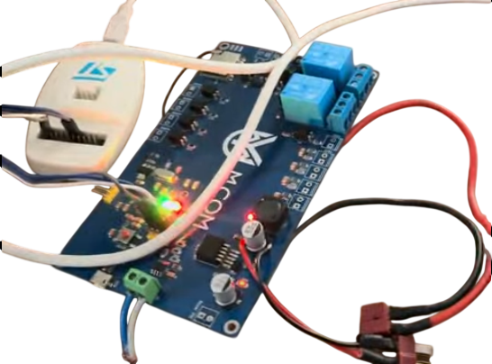
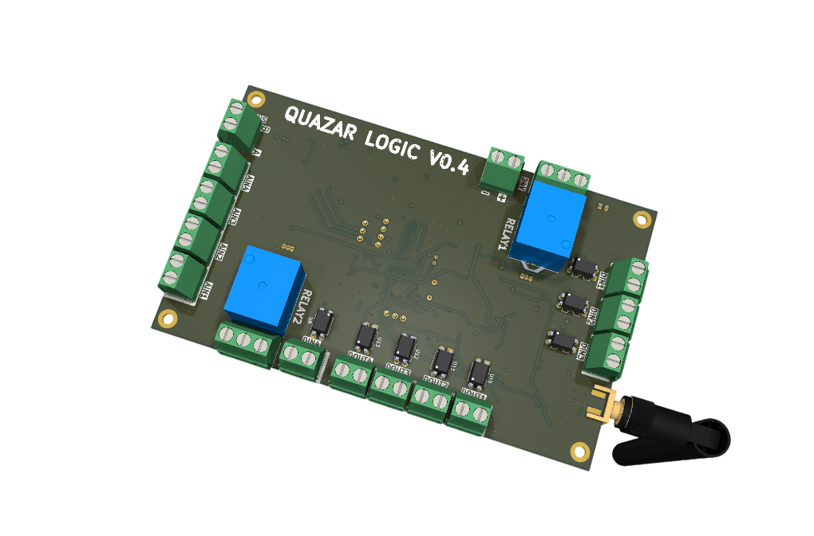
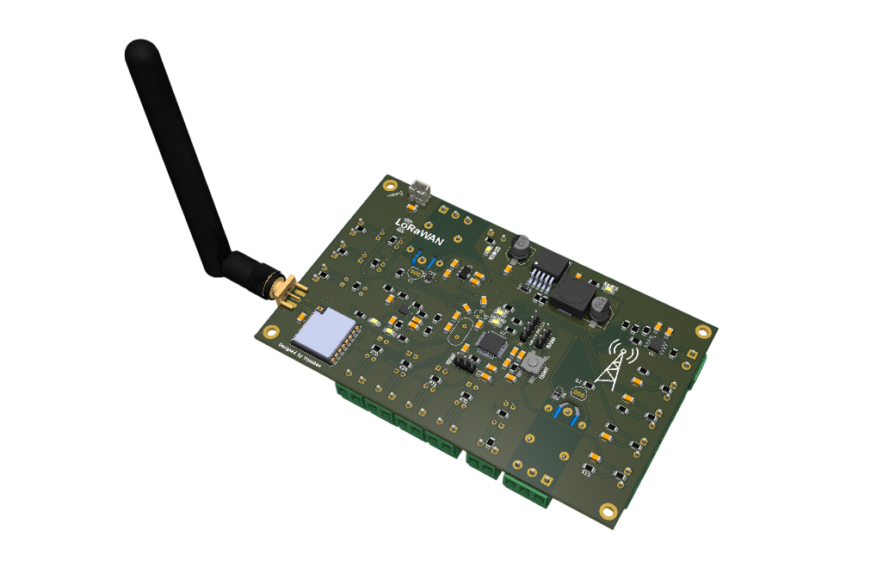

# Caspian Monitor

Система экологического мониторинга акватории Каспийского моря на базе сети LoRaWAN.

Проект разработан для Международного хакатона «Caspian Hackathon» (5–12 августа 2026 г.,
Управление молодежной политики Мангистауской области) в рамках Международной недели
действий «Caspian Sea Action Week».

---

## 1. Краткое описание

Экологический мониторинг Каспийского моря остаётся преимущественно ручным: пробы
отбираются экспедиционно, результаты обрабатываются в лаборатории, а сведения о
состоянии акватории поступают к природоохранным органам с задержкой от нескольких суток
до нескольких недель. При аварийном розливе нефтепродуктов это означает, что загрязнение
обнаруживают уже после того, как пятно распространилось.

Caspian Monitor решает задачу непрерывного автоматического наблюдения. Сеть автономных
буёв круглосуточно измеряет показатели качества морской воды и передаёт их по
энергоэффективному радиоканалу LoRaWAN. Сервер декодирует телеметрию, накапливает ряды
наблюдений, автоматически сравнивает значения с нормативными порогами и формирует
события при их нарушении. Оператор видит обстановку по всей акватории на одной панели,
а накопленные данные доступны любому пользователю в машиночитаемом виде без регистрации.

**Контролируемые параметры:** водородный показатель (pH), температура, растворённый
кислород, мутность, удельная электропроводность, общая минерализация,
окислительно-восстановительный потенциал, суммарное содержание углеводородов,
заряд батареи буя.

---

## 2. Архитектура

```
   Буй (STM32F103 + SX1262)
   датчики -> Modbus RTU -> кодирование кадра (18 байт)
        |
        |  LoRaWAN, EU868, SF10 BW125
        v
   Шлюз LoRaWAN
        |
        v
   Сетевой сервер ChirpStack v4
        |
        |  HTTP-интеграция, POST /api/uplink
        v
   +---------------------------------------------------+
   |  Caspian Monitor API  (FastAPI, Python 3.12)      |
   |                                                   |
   |  codec.py   декодирование бинарного кадра         |
   |  db.py      хранение наблюдений (SQLite, WAL)     |
   |  alerts.py  пороговая сигнализация                |
   |  main.py    REST API + выгрузка открытых данных   |
   +---------------------------------------------------+
        |                               |
        v                               v
   Веб-панель оператора           Открытые данные
   (Chart.js, Leaflet)            (CSV, GeoJSON)
```

Ключевое архитектурное решение — **эндпоинт приёма телеметрии совместим с форматом
HTTP-интеграции ChirpStack v4**. Сервер не располагает сведениями об источнике данных.
Благодаря этому входящий в состав проекта эмулятор буёв и реальная сеть LoRaWAN
подключаются к одной и той же точке входа, а переход от демонстрационного стенда к
промышленной эксплуатации выполняется указанием адреса сервиса в настройках
ChirpStack — без изменений в программном коде.

---

## 3. Минимальные системные требования

| Компонент | Требование |
|---|---|
| Операционная система | Linux, macOS или Windows 10/11 |
| Docker Engine | 24.0 и выше |
| Docker Compose | v2.20 и выше (входит в состав Docker Desktop) |
| Оперативная память | 1 ГБ свободно |
| Дисковое пространство | 500 МБ |
| Сетевые порты | 8000/TCP (изменяется в файле `.env`) |
| Браузер | Chrome, Firefox или Edge актуальной версии |

Для запуска без Docker дополнительно требуется Python 3.11 или выше.

---

## 4. Установка и запуск

### 4.1. Основной способ — Docker Compose

```bash
git clone https://github.com/eskenkydyr-source/caspian-monitor.git
cd caspian-monitor
cp .env.example .env
docker compose up --build
```

Первый запуск занимает 2–3 минуты: собираются образы, создаётся база данных и
записывается ретроспектива наблюдений за 90 суток.

После появления в журнале строки `Application startup complete` откройте в браузере:

**http://localhost:8000**

Всё остальное происходит автоматически. Эмулятор буёв дожидается готовности сервера и
начинает передачу телеметрии с интервалом 10 секунд; показания на панели обновляются
каждые 5 секунд.

Остановка: `Ctrl+C`, затем `docker compose down`.
Полная очистка вместе с базой данных: `docker compose down -v`.

### 4.2. Запуск без Docker

Требуются два терминала.

Терминал 1 — сервер:

```bash
cd backend
python -m venv .venv
source .venv/bin/activate          # Windows: .venv\Scripts\activate
pip install -r requirements.txt
DB_PATH=./caspian.db FRONTEND_DIR=../frontend python -m uvicorn app.main:app --port 8000
```

Терминал 2 — эмулятор буёв:

```bash
cd simulator
python simulator.py --api http://localhost:8000 --interval 10
```

Панель откроется по адресу http://localhost:8000.

### 4.3. Проверка работоспособности

```bash
curl http://localhost:8000/health
curl http://localhost:8000/api/buoys
curl "http://localhost:8000/api/export?format=csv&hours=1"
```

Интерактивная документация API: **http://localhost:8000/api/docs**

---

## 5. Данные для входа

Аутентификация в веб-панели не предусмотрена: система носит характер публичного
сервиса экологического мониторинга, и доступ к данным наблюдений открыт. Тестовая
учётная запись не требуется.

Защищается только приём телеметрии. Токен задаётся переменной `INGEST_TOKEN` в файле
`.env`; при пустом значении эндпоинт `/api/uplink` открыт, что удобно для проверки.
При заданном токене запрос сопровождается заголовком `Authorization: Bearer <токен>`.

---

## 6. Основные функции

**Оперативный контроль.** Панель отображает текущие показания всех буёв сети, сводный
статус каждого устройства (норма, внимание, тревога, вне связи) и качество радиоканала
LoRaWAN — уровень принимаемого сигнала, отношение сигнал/шум, интенсивность обмена и долю
потерянных кадров.

**Пороговая сигнализация.** Каждое принятое измерение автоматически сравнивается с
нормативными границами. Предусмотрены два уровня — предупредительный и критический,
отдельно по верхней и нижней границе. Пороги хранятся в базе данных и редактируются
через интерфейс без перезапуска сервиса. Предусмотрено подавление повторных срабатываний:
пока событие не квитировано оператором, дубликаты не создаются.

**Ретроспективный анализ.** Ряды наблюдений доступны с глубиной от одного часа до 90
суток. Агрегация выполняется на стороне сервера: при увеличении глубины выборки данные
группируются по часам или суткам, что сохраняет отзывчивость интерфейса независимо от
объёма накопленных наблюдений.

**Пространственное представление.** Буи нанесены на карту акватории с цветовой
индикацией состояния, что позволяет оценить географию загрязнения и проследить
распространение.

**Разбор кадров.** Встроенный инструмент декодирует произвольный кадр LoRaWAN, заданный
шестнадцатеричной строкой. Применяется тот же программный кодек, что и при приёме
телеметрии, — это исключает расхождение форматов между сервером и прошивкой буя и
служит средством диагностики при пусконаладке оборудования.

**Открытые данные.** Наблюдения выгружаются в форматах CSV и GeoJSON без аутентификации.
Формат GeoJSON пригоден для непосредственной загрузки в QGIS, ArcGIS и иные
геоинформационные системы. Ограниченная доступность экологических данных названа в
Техническом задании хакатона одной из проблем региона; открытый интерфейс выгрузки —
прямой ответ на неё.

---

## 7. Формат кадра телеметрии

Кадр передаётся на fPort 2 в порядке байтов от старшего к младшему. Минимальная длина
12 байт, полная — 18 байт. Приёмная сторона корректно обрабатывает укороченные кадры,
что позволяет буям с сокращённым составом датчиков работать в той же сети.

| Смещение | Размер | Тип | Параметр | Масштаб | Единица |
|---|---|---|---|---|---|
| 0 | 2 | uint16 | Водородный показатель | /100 | pH |
| 2 | 2 | int16 | Температура | /10 | °C |
| 4 | 2 | uint16 | Растворённый кислород | /100 | мг/л |
| 6 | 2 | uint16 | Мутность | 1 | NTU |
| 8 | 2 | uint16 | Удельная электропроводность | /10 | мСм/см |
| 10 | 2 | uint16 | Сумма углеводородов | /1000 | мг/л |
| 12 | 2 | int16 | Окислительно-восстановительный потенциал | 1 | мВ |
| 14 | 2 | uint16 | Общая минерализация | ×10 | мг/л |
| 16 | 1 | uint8 | Заряд батареи | 1 | % |
| 17 | 1 | uint8 | Флаги состояния | битовое поле | — |

Флаги состояния: бит 0 — отказ датчика pH, бит 1 — отказ датчика растворённого
кислорода, бит 2 — низкий заряд батареи, бит 3 — срабатывание детектора
нефтепродуктов, бит 4 — вскрытие корпуса.

Пример разбора кадра:

```bash
curl -X POST http://localhost:8000/api/decode \
  -H "Content-Type: application/json" \
  -d '{"hex": "032C008F030C000C00F6002900C604E45700"}'
```

---

## 8. Программный интерфейс

| Метод | Путь | Назначение |
|---|---|---|
| POST | `/api/uplink` | Приём кадра телеметрии (формат ChirpStack v4) |
| POST | `/api/decode` | Разбор кадра по шестнадцатеричной строке |
| GET | `/api/buoys` | Реестр буёв с последними значениями и статусом |
| GET | `/api/buoys/{dev_eui}/history` | Ряд наблюдений; `range` = 1h, 6h, 24h, 7d, 30d, 90d |
| GET | `/api/packets` | Журнал принятых кадров |
| GET | `/api/alerts` | Журнал пороговых событий |
| POST | `/api/alerts/{id}/ack` | Квитирование события оператором |
| GET | `/api/thresholds` | Действующие пороговые значения |
| PUT | `/api/thresholds` | Изменение пороговых значений |
| GET | `/api/network/stats` | Показатели работы сети LoRaWAN |
| GET | `/api/stats` | Сводные показатели системы |
| GET | `/api/export` | Выгрузка данных; `format` = csv, geojson |
| GET | `/health` | Проверка доступности сервиса |

Полная спецификация в формате OpenAPI доступна по адресу `/api/docs`.

---

## 9. Подключение реальной сети LoRaWAN

Переход от эмулятора к промышленной эксплуатации не требует изменений в коде.

1. В веб-интерфейсе ChirpStack v4 откройте приложение и перейдите в раздел
   **Integrations → HTTP**.
2. В поле **Event endpoint URL** укажите `https://<адрес сервиса>/api/uplink`.
3. При заданном `INGEST_TOKEN` добавьте заголовок `Authorization` со значением
   `Bearer <токен>`.
4. Внесите DevEUI устройств в таблицу `devices` базы данных. Реестр по умолчанию
   определён в файле `backend/app/seed.py`.
5. Остановите эмулятор: `docker compose stop simulator`.

Для территории Республики Казахстан применяется частотный план KZ865. Он задаётся в
настройках сетевого сервера и профиля устройства и не затрагивает серверную часть.

---

## 10. Структура проекта


```
caspian-monitor/
├── backend/                      Серверная часть
│   ├── app/
│   │   ├── main.py               Приложение FastAPI, маршруты API
│   │   ├── codec.py              Кодек полезной нагрузки LoRaWAN
│   │   ├── db.py                 Слой доступа к данным, схема БД
│   │   ├── alerts.py             Движок пороговой сигнализации
│   │   └── seed.py               Реестр буёв, генерация ретроспективы
│   ├── tests/
│   │   └── test_codec.py         Модульные тесты кодека и логики порогов
│   ├── requirements.txt          Зависимости Python
│   └── Dockerfile
├── frontend/                     Веб-панель оператора
│   ├── index.html                Интерфейс: панель, история, карта, настройки
│   └── api-bridge.js             Связующий слой с программным интерфейсом
├── hardware/                     Аппаратная платформа и прошивка (Quazar Logic)
│   ├── cad/                      3D-модель печатной платы (board_0.2.step)
│   ├── hardware/                 Схемотехника и чертежи печатной платы (output.pdf)
│   └── software/                 Прошивка STM32 (Makefile, CMSIS/HAL, linker scripts)
├── simulator/                    Эмулятор сети буёв
│   ├── simulator.py              Формирование и передача кадров телеметрии
│   └── Dockerfile
├── mvp_hardware.png              Фотография рабочего прототипа (MVP)
├── Quazar_logic_v4_image1.png    3D-визуализация платы Quazar Logic v0.4 (top)
├── Quazar_logic_v4_image2.png    3D-визуализация платы Quazar Logic v0.4 (bottom)
├── docker-compose.yml            Развёртывание одной командой
├── .env.example                  Образец файла конфигурации
└── README.md                     Документация проекта
```

---

## 11. Используемые технологии и зависимости

**Серверная часть**

| Компонент | Версия | Лицензия | Назначение |
|---|---|---|---|
| Python | 3.12 | PSF | Среда исполнения |
| FastAPI | 0.115.6 | MIT | Веб-фреймворк, генерация OpenAPI |
| Uvicorn | 0.34.0 | BSD-3-Clause | ASGI-сервер |
| Pydantic | 2.10.4 | MIT | Валидация входящих данных |
| SQLite | встроен в Python | Public Domain | Хранение наблюдений |

**Клиентская часть**

| Компонент | Версия | Лицензия | Назначение |
|---|---|---|---|
| Chart.js | 4.4.1 | MIT | Построение графиков |
| Leaflet | 1.9.4 | BSD-2-Clause | Картографическая подложка |
| OpenStreetMap | — | ODbL | Картографические данные |

Эмулятор буёв реализован исключительно средствами стандартной библиотеки Python и
внешних зависимостей не имеет.

Условия всех перечисленных лицензий допускают использование в составе настоящего
проекта. Готовые коммерческие продукты и программный код сторонних разработчиков за
пределами указанных библиотек не применялись.

---

## 12. Демонстрационные данные

В соответствии с п. 5.3 Технического задания хакатона в системе применяется тестовый
набор данных. Его состав и назначение:

**Ретроспектива наблюдений** — 90 суток с часовым разрешением, 34 560 записей.
Формируется при первом запуске и включает суточную и сезонную динамику температуры и
растворённого кислорода. Необходима для наполнения вкладки ретроспективного анализа.

**Оперативная телеметрия** — формируется эмулятором и поступает в систему
**исключительно через эндпоинт `/api/uplink`**, то есть по тому же тракту, что и данные
реальной сети. Значения в интерфейсе не генерируются: веб-панель получает их
запросами к программному интерфейсу.

**Сценарий аварийного розлива.** Через две минуты после запуска на буе BY-02
(платформа CK-2) начинается развитие модельной аварии: суммарное содержание
углеводородов возрастает с 0,03 до 0,58 мг/л, увеличивается мутность, снижаются
содержание растворённого кислорода и водородный показатель. Система последовательно
формирует предупредительное, а затем критическое событие, буй меняет состояние на карте.
Сценарий предназначен для демонстрации работы сигнализации и отключается ключом
`--no-spill`.

**Потеря связи.** Буи BY-04 и BY-16 телеметрию не передают и по истечении таймаута
автоматически переводятся в состояние «вне связи». Сценарий демонстрирует контроль
доступности оборудования.

---

## 13. Тестирование

```bash
cd backend
python tests/test_codec.py
```

Проверяется обратимость кодирования кадра, обработка отрицательных температур,
отбраковка укороченных и физически недостоверных кадров, разбор шестнадцатеричных
строк и логика определения уровня порогового события.

---

## 14. Направления дальнейшего развития

Работа над проектом продолжается в соответствии с п. 21 Технического задания.
Приоритетные направления:

- прогнозирование распространения загрязнения на основе данных о ветре и течениях с
  оценкой зоны воздействия на несколько часов вперёд;
- выявление аномалий методами машинного обучения — распознавание нехарактерных
  сочетаний параметров, не выходящих за отдельные пороговые значения;
- сопоставление данных буёв со спутниковыми снимками Sentinel-1 для подтверждения
  нефтяных пятен по радиолокационным данным;
- мобильное приложение для инспекторов природоохранных органов с оповещениями;
- программный интерфейс передачи данных в информационные системы уполномоченных
  органов в области охраны окружающей среды;
- расширение состава контролируемых показателей — тяжёлые металлы, нефтепродукты по
  раздельным фракциям, гидроакустический контроль для задач охраны биоресурсов.

---

## 15. Авторы

| Участник | Вклад |
|---|---|
| Кыдырбаев Ескендир | Разработка проекта |
| Сансызбай Ырысжан | Разработка проекта |

Команда: Quasar
Хакатон: Caspian Hackathon, 5–12 августа 2026 г., г. Актау

---

## 16. Лицензия

Исключительные права на проект принадлежат участникам команды в соответствии с
п. 20.1 Технического задания хакатона.

# 2.1. Аппаратная платформа (Hardware)
Аппаратная часть узлов экологического мониторинга разработана на базе контроллера собственной разработки Quazar Logic. Разработка и валидация аппаратно-программного комплекса проходили в два этапа: от быстрого макетирования MVP до проектирования специализированной печатной платы (PCB).

## Этап 1. Прототипирование и стендовое тестирование (MVP)

Для экспресс-валидации протокола взаимодействия, работы шины Modbus RTU и алгоритмов упаковывания кадров (18 байт) в течение 2 дней был собран и отлажен лабораторный стенд (MVP Hardware) на базе синей отладочной платы Quazar Logic.

Микроконтроллер: STM32F103 (тактирование, периферия USART/I2C/ADC, прошивка через ST-Link V2).

Питание и индикация: Организована схема преобразования питания с защитой и светодиодной индикацией статуса работы узла/передачи данных.



### Результаты этапа:

Успешно проверена корректность сбора данных с аналоговых и цифровых датчиков (pH, O2, температура, мутность).

Настроена и протестирована прошивка отправки бинарных упакованных пакетов в сеть LoRaWAN (EU868 / KZ865).

## Этап 2. Проектирование кастомного узла сбора данных (Quazar Logic v0.4)
После успешных стендовых испытаний MVP был спроектирован и подготовлен к производству специализированный модуль Quazar Logic v0.4, адаптированный под жесткие условия автономного морского базирования на буях.

Технические характеристики платы Quazar Logic v0.4:
Вычислительное ядро: МК серии STM32F103 в компактном QFP-корпусе с ультранизким энергопотреблением в режиме Deep Sleep.

Радиомодуль LoRaWAN: Интегрированный трансивер Semtech SX1262 (SMA-разъем для подключения внешней антенны 868 МГц) с поддержкой классов энергосбережения Class A / Class C.

Интерфейсы подключения датчиков:



Аналоговый блок: 4 изолированных аналоговых входа (AIN1–AIN4) с фильтрацией помех для прямой стыковки с сенсорами pH, ORP, DO (растворенный кислород).

Цифровой блок: 3 дискретных входа (DIN1–DIN3) с опторазвязкой для контроля датчиков вскрытия корпуса и флагов аварии.

Управление и коммутация: 2 силовых электромагнитных реле (RELAY1, RELAY2) для управления питанием погружных датчиков и очистных систем, а также 4 транзисторных выхода (DOUT1–DOUT4).



Промышленный шинный интерфейс: RS-485 / Modbus RTU для подключения комплексных гидрографических зондов.

Система питания: Широкий диапазон входного напряжения (поддержка LiFePO4 / солнечных батарей 12–24V) с высокоэффективным Buck-регулятором.

